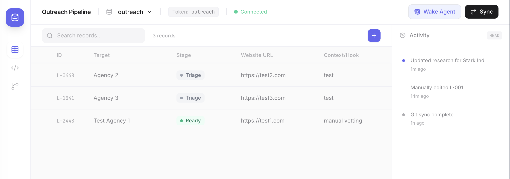

# Outreach Pipeline



A **Local-First, JSON-backed, Git-synced** outreach management system. This app acts as a headless CMS for AI agents, presented as a high-performance spreadsheet.

## 🏗️ Architecture

- **Local-First**: Complete data ownership. No cloud database required.
- **JSON-backed**: Each record is a separate, beautifully indented JSON file in `data/records/`. This makes Git diffs clean and merge conflicts rare.
- **Git-sycned**: Your audit history and version control are handled by regular Git commits.
- **WebSocket Sync**: The UI live-updates instantly when local files are changed (by you or an AI agent) via a built-in file watcher.

## 🚀 Getting Started

You can run the system using Docker (recommended) or manually by starting the backend and frontend dev servers separately.

### Using Docker (Recommended)

The easiest way to get the system running is using Docker Compose, which handles building the frontend and running the server automatically. We provide convenience scripts in the `bin/` folder for this:

```bash
# To build and start the system (best for first run or after changes):
./bin/rebuild

# To start the system without rebuilding:
./bin/start

# To stop the system:
./bin/stop

# To check if the system is running:
./bin/status
```

*The application and API are available at `http://localhost:3001`*

### Running Manually

#### 1. Install Dependencies
```bash
yarn install
```

#### 2. Start Backend Server
The server handles reading/writing JSON files and broadcasts changes via WebSockets.
```bash
yarn workspace server start
```
*Server runs on `http://localhost:3001`*

#### 3. Start Frontend
```bash
yarn dev
```
*Frontend runs on `http://localhost:5173` (requests to `/api` are automatically proxied to the backend).*

## 📁 Project Structure

```text
pipeline/
├── data/
│   ├── schema.json       # Defines your columns and pipeline rules
│   └── records/          # Folder-as-a-Table (one JSON file per row)
├── server/
│   └── index.js          # Express server with file watcher & WebSockets
├── src/
│   ├── components/       # React UI components
│   ├── App.tsx           # Main application logic & data fetching
│   └── main.tsx          # Entry point
├── package.json
└── vite.config.ts        # Includes proxy configuration
```

## 🛠️ Tech Stack

- **Frontend**: React 18, Tailwind CSS, Lucide Icons, Vite.
- **Backend**: Node.js, Express, Chokidar (file watching), WS (WebSockets).
- **Storage**: Flat-file JSON (Git-friendly).

## 🤖 AI Agent Integration

This app is designed to be co-piloted by AI agents. Agents can:
1. Read the project context from `AGENTS.md`.
2. Understand the table structure from `data/schema.json`.
3. Directly manipulate data by creating/editing files in `data/records/`.
4. The UI will instantly reflect these changes for the human user.

## License

AGPL-3.0
