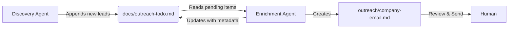

# 🤖 Agent Orchestration: Outreach Pipeline

This document outlines the autonomous agent workflow for discovering new leads and drafting personalized outreach emails for RedactSolo. The process is divided into two distinct tasks that coordinate via a central todo list.

---

## 📂 Central Data Store

**File:** [`docs/outreach-todo.md`](docs/outreach-todo.md)

This file acts as the **state of truth** and the queue for the entire pipeline.
- **Input:** New leads are appended here by the Discovery agent.
- **Queue:** Unchecked items (`- [ ]`) represent pending work.
- **Output:** Checked items (`- [x]`) represent completed research with links to generated email drafts.

---

## 🕵️‍♂️ Task 1: Discovery (The Scout)

**Source:** [`docs/discovery.md`](docs/discovery.md)

**Objective:** continuously find *new* recruitment agencies that are not yet in the system.

### Workflow:
1.  **Read & Blocklist:** The agent reads `docs/outreach-todo.md` to build a list of existing domains to ignore.
2.  **Generate Query:** Uses a "Variety Engine" to create unique search queries combining Niche + Location + Type (e.g., "Legal Headhunters in Toronto").
3.  **Search & Qualify:**
    -   Performs web searches (excluding major aggregators like Indeed/LinkedIn).
    -   Visits agency websites to scan for "Hooks" (keywords: *manual vetting*, *privacy*, *blind hiring*, *high-touch*).
4.  **Append:** Adds new, qualified leads to the bottom of `docs/outreach-todo.md` in a standardized format:
    ```markdown
    - [ ] **[Company Name]** - [URL] - Context: "[Brief hook/quote]"
    ```

---

## ✍️ Task 2: Enrichment & Drafting (The Writer)

**Source:** [`docs/task.md`](docs/task.md)

**Objective:** Research specific contact details for pending leads and draft high-quality, personalized emails.

### Workflow:
1.  **Pick Leads:** Selects the next **2 unchecked** items from `docs/outreach-todo.md`.
2.  **Deep Research:**
    -   **Find Contact:** Prioritizes direct emails (info@, hello@, specific recruiters) over contact forms.
    -   **Find Hook:** Identifies a specific relevant detail (e.g., "We manually format every CV") to personalize the message.
3.  **Draft Email:**
    -   Creates a new file: `outreach/[company-slug]-email.md`.
    -   Uses a playful "Tired Developer" persona (direct, helpful, no marketing fluff).
    -   **Constraint:** Under 120 words, lowercase subject, specific hook.
4.  **Update State:**
    -   Marks the item as checked (`- [x]`) in `docs/outreach-todo.md`.
    -   Appends the research data (Contact, Focus, Hook) and the path to the draft email.

---

## 🔄 Orchestration Cycle

The two agents work in a loop:

1.  **Discovery Agent** fills the queue (`docs/outreach-todo.md`) with fresh URLs.
2.  **Enrichment Agent** drains the queue by processing items, researching them, and generating artifacts in the `outreach/` folder.
3.  **Human Review:** A human reviews the generated markdown files in `outreach/` and sends the emails.


